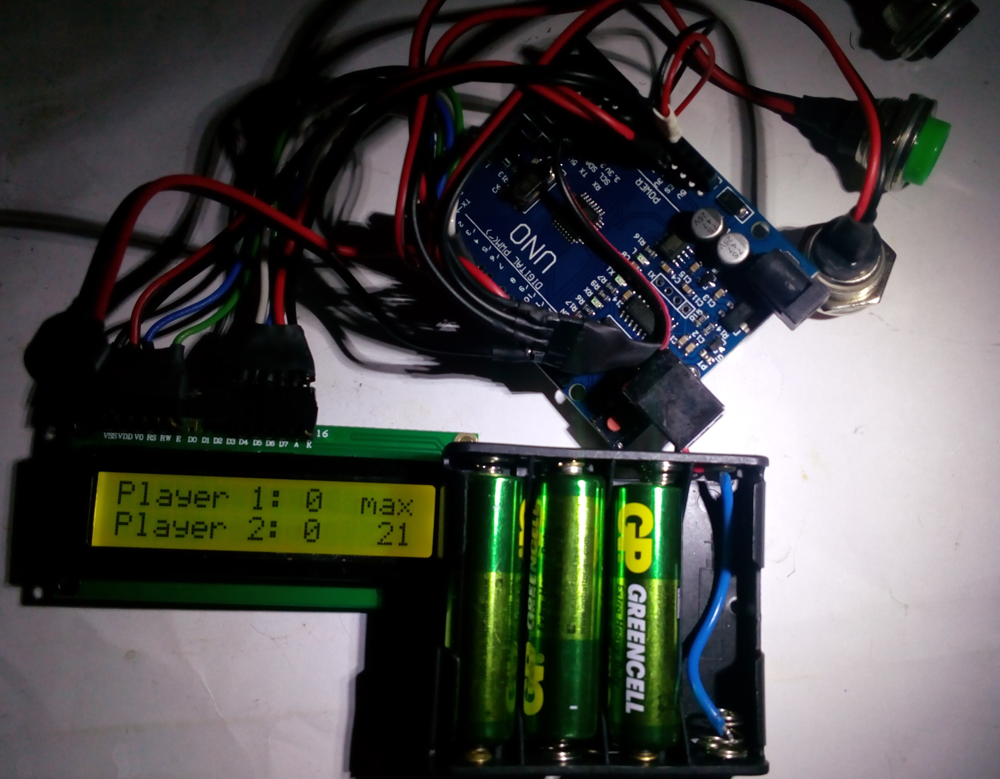
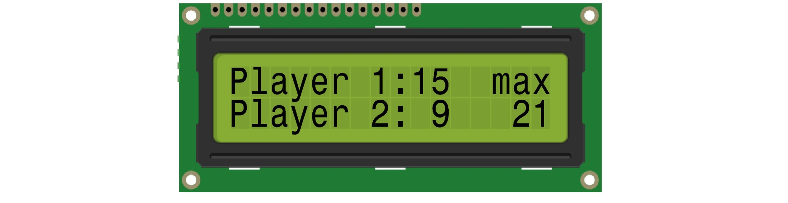
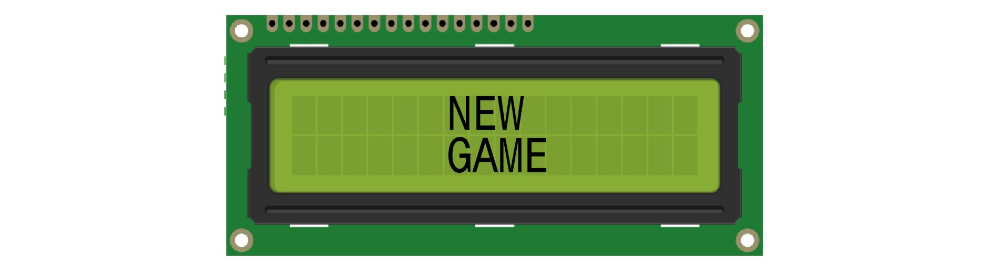
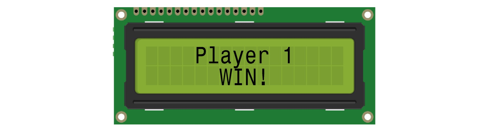
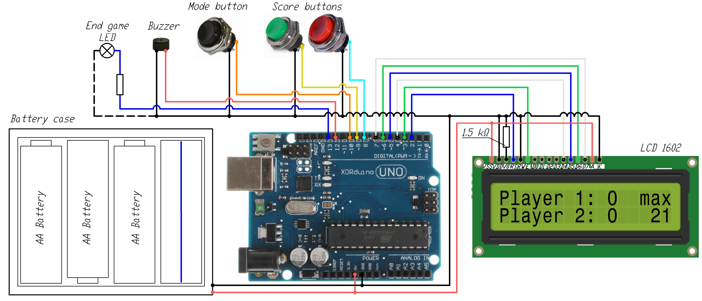
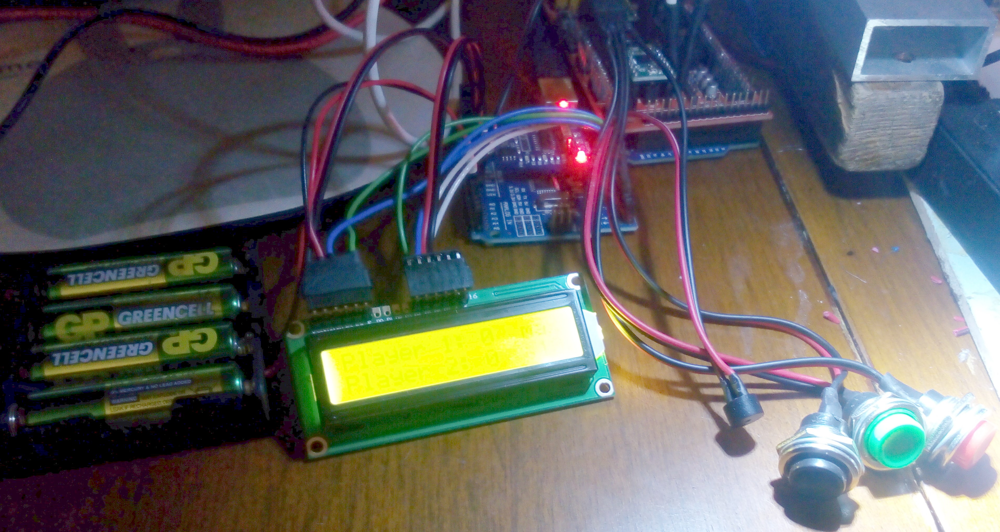

# Score Board
Simple score counter with LCD screen to count board game score. 

Before start of the game the final goal for ending the game is set and counter is set to zero.

Each player has button to add score point or current progress. After adding score point a beep is played (different for different players) and the point is displayed on the screen as well as the second player's points and the final goal.

When the final result is reached, a sound signal is played and messages about the winning of the corresponding player are shown.

The system has several modes for different games, which can be switched by long pressing the mode button. A short press of the mode button resets the points and starts a new game

The system is assembled in a compact case and does not require external power supply (onboard AAA batteries).

## Display interface

System includes symbolic LCD display 1602 (2 rows 16 symbols each)
In standard mode display shows current scores of each player (`Player 1:##` and `Player 2:##`) and final goal (`max ##`)
Short press on "Score" button will increment score point to corresponding player.

When system being initializing screen shows message `NEW GAME` for 2 seconds and then switch to standard mode.

Short press of "Mode" button will reset current game and the new game message will also be shown.

Long press of "Mode" button will switch game mode - final goal for ending the game  will cycle switch.

Each change of players score or mode change will checks whether we have reached the target account. If yes, then a message `Player # WIN!`  is displayed

## System parameters

* Main controller		– Arduino Uno 
* Processor 			– 16 MGh, ATmega328P
* Controller memory		– 32 KB Flash + 2 kB SRAM + 1kB EEPROM
* LCD screen			– LCD 1602
* Screen size			– 64.5x13.8 mm
* Character size		– 4.35x2.95 mm
* Pixel size			– 0.5x0.5 mm
* Power supply 			– 4,5..5V (3xAA 1.5V batteries or 4xAA 1.2V accumulators)
* Case dimensions		– 75x60x20 mm
* Weight				– 180g (with batteries and case)

## Components
* [Arduino Uno](https://amzn.to/3sd5Qp6)			- 1pcs.
* [LCD Display Module 1602 ](https://amzn.to/49DoVBJ )			-1 pcs.
* [Momentary Push Buttons](https://amzn.to/46ZHFt3) 		- 3 pcs.
* [Active Buzzer](https://amzn.to/3MyhrWm)			-1 pcs.
* [Battery Holder 4xAA ](https://amzn.to/3FNY345)	- 1 pcs.

## Wiring diagram

## Possible system improvements
- [ ] Personalization of players (adding names, pictograms etc.)
- [ ] Increased quantity of players
- [ ] Adding timers for each move and the game as a whole
- [ ] Bigger screen (LCD 1604 or TFT display with graphics)
- [ ] Connection to full size displays
- [ ] Sound effects (replacing buzzer by speaker, mp3 support etc.)
- [ ] Remote control (Bluetooth, web-interface)

## Photos

